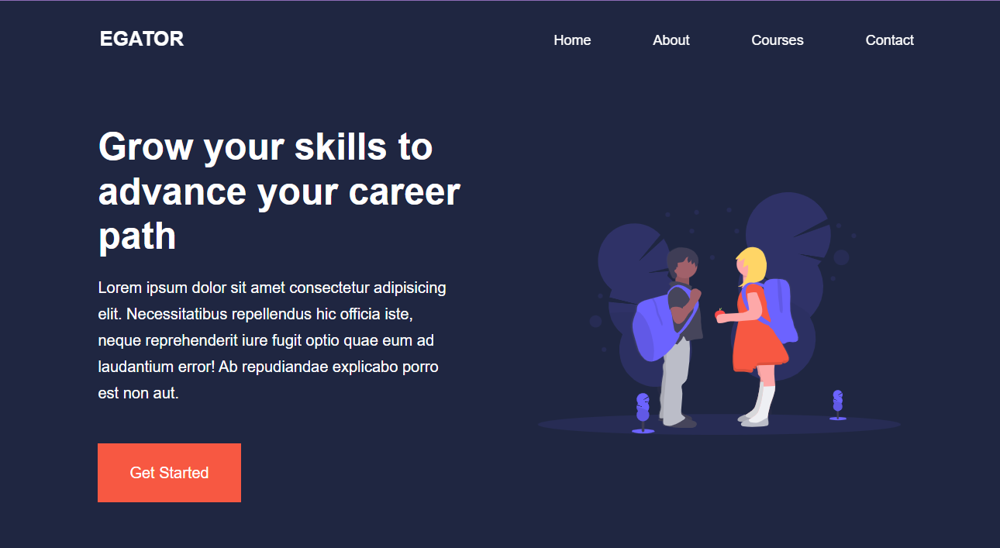
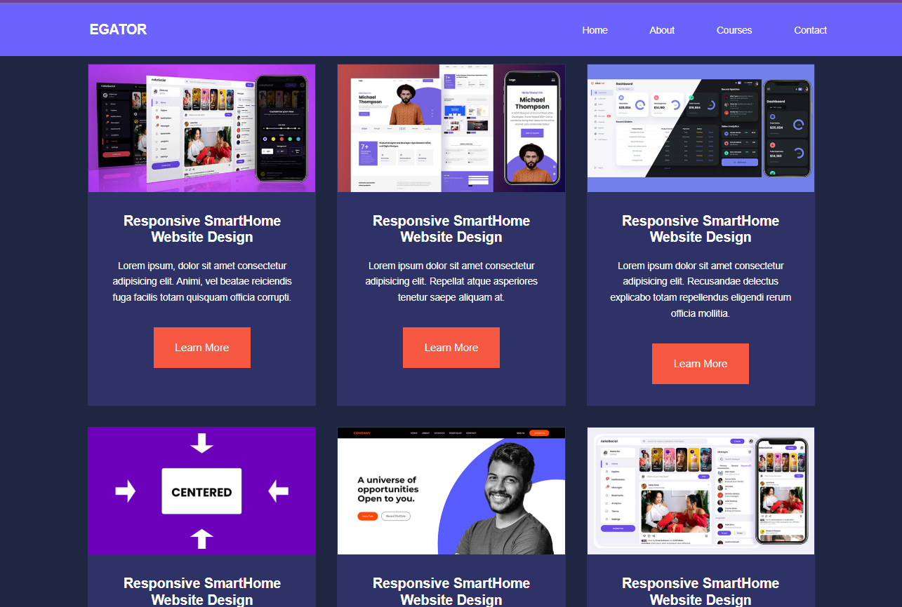
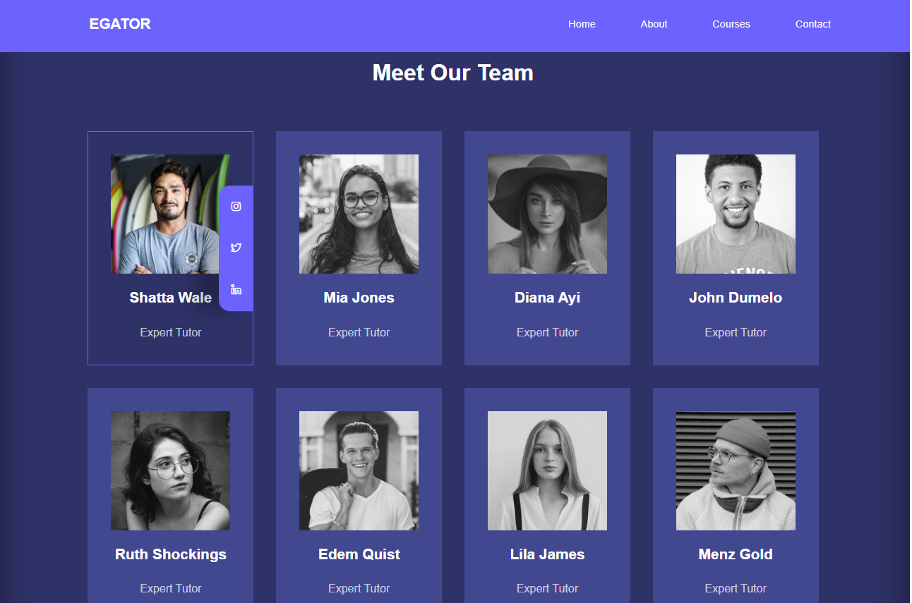
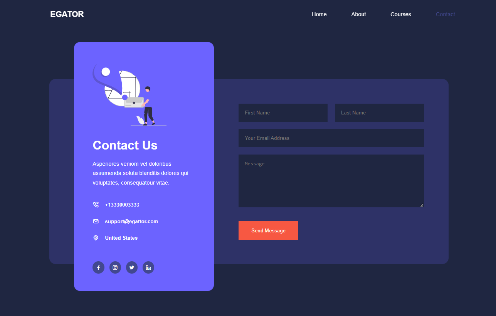

# Education Website Template
A **responsive** multi-page education website built using **HTML, CSS, and JavaScript**. This platform provides an interactive and user-friendly experience for users looking to explore educational courses, read testimonials, and contact instructors,  .   

## Live Demo [Click here to view the live site](https://ellafsd.github.io/education-website-template/ )    

## 📺 Live Preview
### 🏠 Homepage

### 📞 Contact Page

### 👥 Team

  

## 📸 Screenshots
### Homepage

### Homepage - Lower Section

### Meet Our Team - Hover Effect
 

### Contact Page
   

## ✨ Features
### Homepage
- 🏁 **Get Started Button**: Clicking the **Get Started** button redirects users to the **Courses** page.
- 🔽 **Frequently Asked Questions (FAQs)**: Click the **+** icons to expand and reveal answers.
- ⭐ **Testimonials Carousel**: Use the **dots** under testimonials to navigate between student reviews.
- 📜 **Footer Section**: Located at the bottom, providing useful links and contact information.
### About Page
- 🎓 **Meet Our Team**: Hover over an instructor’s profile to reveal their **social media links**.
### Courses Page
- 📖 **Course Listings**: Users can browse various courses with descriptions and images.
- 🔍 **Learn More Button**: Clicking the button on any course directs users to more information.
### Contact Page
- 📞 **Contact Form**: Users can fill out a form to reach out for inquiries.
- 📲 **Social Media Links**: Links to official **Facebook, Instagram, Twitter, and LinkedIn**.    

### General Features
- 🌗 **Light/Dark Mode Toggle**: Switch between light and dark themes.
- 🎞 **Movie List Carousel**: Scroll through available courses using left/right arrows.
- 🖱️ **Hover Effects**: Interactive hover effects on team members and course items.
- 📱 **Responsive Design**: Optimized for desktop, tablet, and mobile devices.   

## 🛠 Technologies Used
- **HTML** 🏗️: Structure of the website
- **CSS** 🎨: Styling and layout
- **JavaScript** 🧩: Interactivity (theme toggle, FAQ expansion, testimonials carousel)
- **Bootstrap Icons** ✨: Used for various icons
- **Swiper.js** 🎡: Used for the testimonial slider  
- **Iconscout** 🖼️: Provides icons for UI elements  

